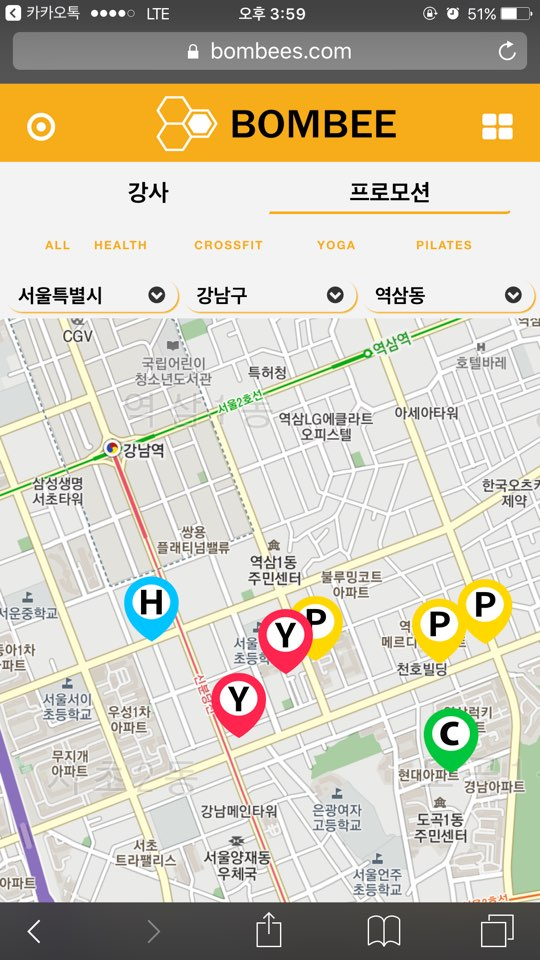
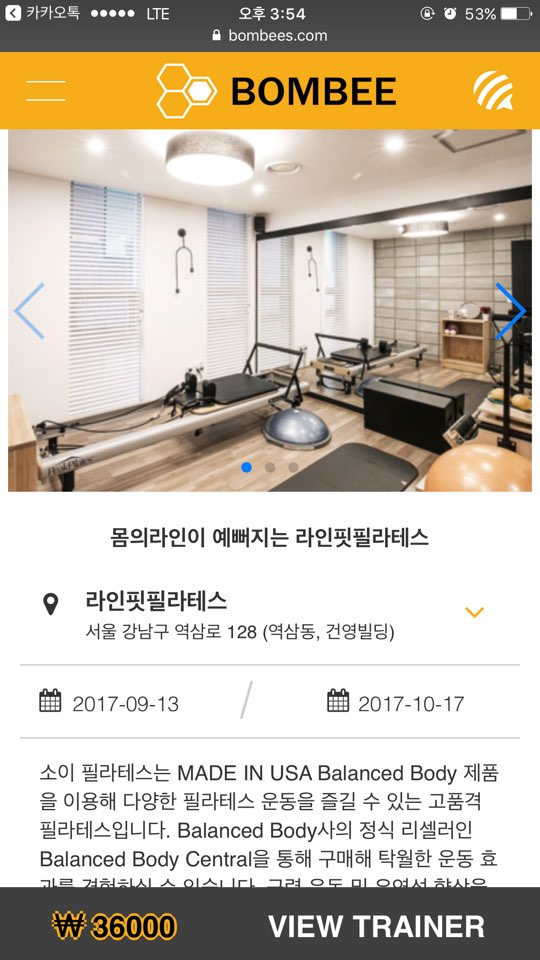
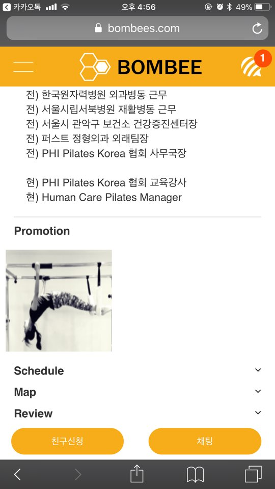
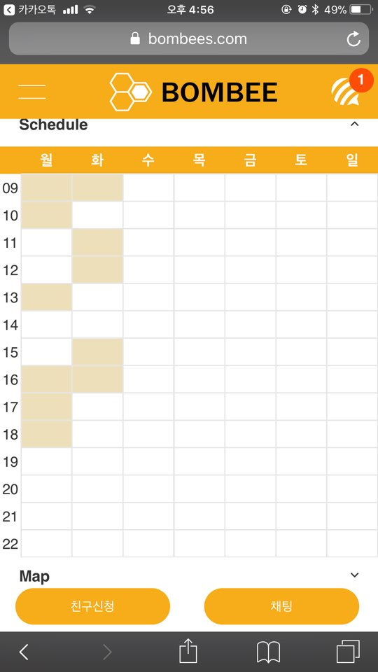
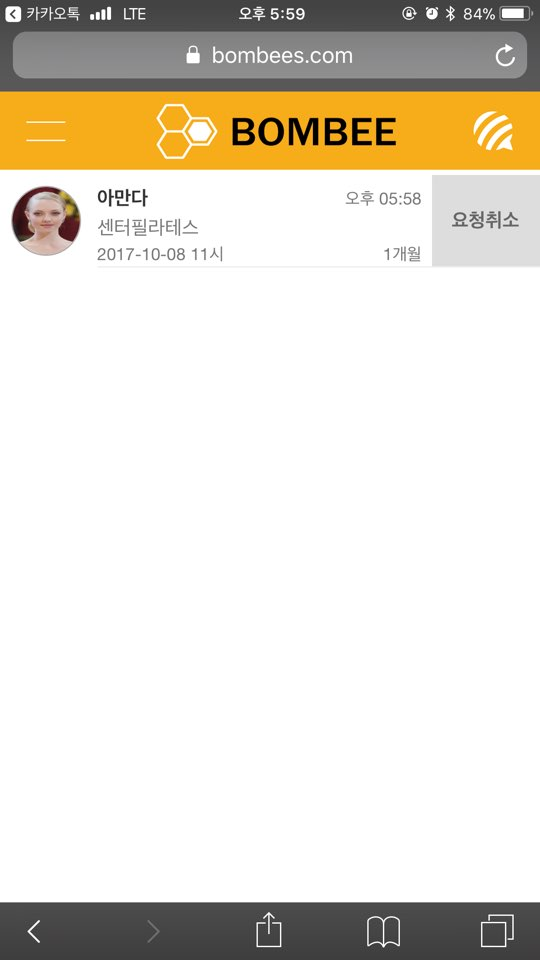
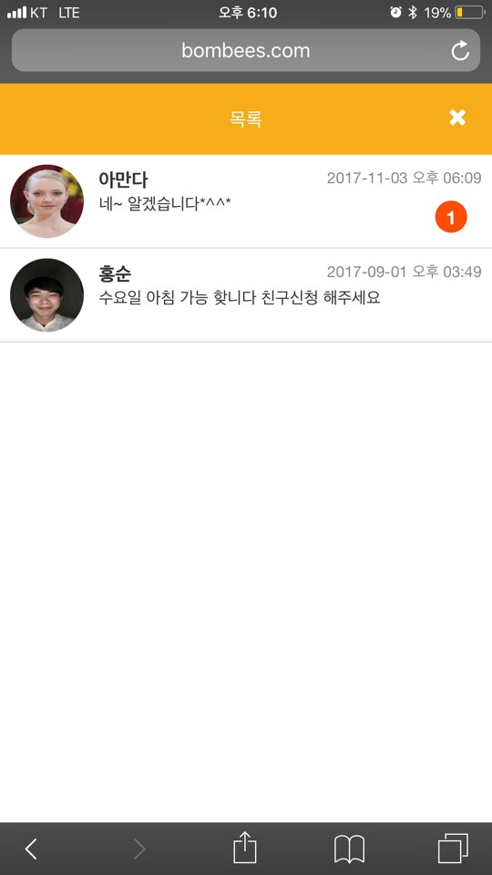

# BOMBEE (url: https://www.bombees.com)

**실시간 내 위치 기반**으로 개인 트레이너를 찾아 쉽고 간편하게 트레이너의 상세 정보 및 스케줄을 파악하여
**원하는 시간에, 원하는 운동을, 원하는 강사에게** 트레이닝 받기 위한 서비스를 제공하는 모바일 웹 프로젝트입니다.

- 사용할 수 있는 환경 : iPhone 6, 6+

# 개발 기간

- 2017.07.01~2017.09.01

# 개발 동기

요즘 바쁜 현대인들은 건강을 중요시하지만, 시간이 부족하여 단기간에 트레이닝을 받아 높은 운동 효과를 내기 위해 개인 트레이너를 찾곤 합니다..
하지만, 트레이닝을 받기 위해 트레이너의 스케줄, 트레이너의 특징 등을 알려면 수많은 헬스장을 찾아다니고 전화로 문의해야 하는 번거로움이 있었습니다.
이러한 문제점을 해결하기 위하여 만들어 보게 되었습니다.

# 개발 목적
```
1. 실시간 내 위치 기반으로 개인 트레이너를 찾을 수 있습니다.
2. 트레이너에게 개인정보(핸드폰번호, SNS ID 등)를 사용하지 않고 실시간 채팅 기능으로 편리하게 연락할 수 있습니다.
3. 개인 트레이너 매칭 후 한 끼 식사를 사진으로 바로 찍어 올리는 등 쉽고 간편하게 식단 관리를 받을 수 있습니다.
 ```
 # 개발 환경
 ```
- Back End : Spring Framework
- DB : MySql
- Build : Gradle
- Server : AWS(Amazon WebServer), Tomcat8, NodeJS
- Front End : AJAX, moment.js
- Api : Kakao Login, Daum map
- Tool : Eclipse, Atom, eXERD,
```
#

1. [회원가입/로그인](./Readme/Page/page1.md)<br>
2. [이벤트 등록/조회/수정/삭제](https://github.com/k0102575/ProjectArmu/blob/master/README%20md/page2.md)<br>
3. [뮤지션 상세조회 및 참여 요청](https://github.com/k0102575/ProjectArmu/blob/master/README%20md/page3.md)<br>
4. [관심 뮤지션 관리](https://github.com/k0102575/ProjectArmu/blob/master/README%20md/page4.md)<br>
5. [뮤지션 회원가입](https://github.com/k0102575/ProjectArmu/blob/master/README%20md/page5.md)<br>
6. [뮤지션 포트폴리오 관리](https://github.com/k0102575/ProjectArmu/blob/master/README%20md/page6.md)<br>
7. [이벤트 상세조회 및 이벤트 지원](https://github.com/k0102575/ProjectArmu/blob/master/README%20md/page7.md)<br>
7. [공동 제작 부분](https://github.com/k0102575/ProjectArmu/blob/master/README%20md/page8.md)<br><br><br>
# 화면

- Main

 

- Real-time Location Map



- Navigator Bar


- Promotion List



- Trainer

  

- Add Promotion


- Promotion Add List


- Apply for Match


- Notification

 

- Matching Request List

 

- Promotion in Progress


- Diet Management


- Review

 

- Chating

 

## [테이블 구조](./Readme/database/readme.md)<br>
