# BOMBEE (url: https://www.bombees.com)

**실시간 내 위치 기반**으로 개인 트레이너를 찾아 쉽고 간편하게 트레이너의 상세 정보 및 스케줄을 파악하여
**원하는 시간에, 원하는 운동을, 원하는 강사에게** 트레이닝 받기 위한 서비스를 제공하는 모바일 웹 프로젝트입니다.

- 사용할 수 있는 환경 : iPhone 6, 6+

# 개발 기간

- 2017.07.01~2017.09.01

# 개발 동기

요즘 바쁜 현대인들은 건강을 중요시하지만, 시간이 부족하여 단기간에 트레이닝을 받아 높은 운동 효과를 내기 위해 개인 트레이너를 찾곤 합니다..
하지만, 트레이닝을 받기 위해 트레이너의 스케줄, 트레이너의 특징 등을 알려면 수많은 헬스장을 찾아다니고 전화로 문의해야 하는 번거로움이 있었습니다.
이러한 문제점을 해결하기 위하여 만들어 보게 되었습니다.

# 개발 목적
```
1. 실시간 내 위치 기반으로 개인 트레이너를 찾을 수 있습니다.
2. 트레이너에게 개인정보(핸드폰번호, SNS ID 등)를 사용하지 않고 실시간 채팅 기능으로 편리하게 연락할 수 있습니다.
3. 개인 트레이너 매칭 후 한 끼 식사를 사진으로 바로 찍어 올리는 등 쉽고 간편하게 식단 관리를 받을 수 있습니다.
 ```
 # 개발 환경
 ```
- Back End : Spring Framework
- DB : MySql
- Build : Gradle
- Server : AWS(Amazon WebServer), Tomcat8, NodeJS
- Front End : AJAX, moment.js
- Api : Kakao Login, Daum map
- Tool : Eclipse, Atom, eXERD,
```
# 화면
- Login

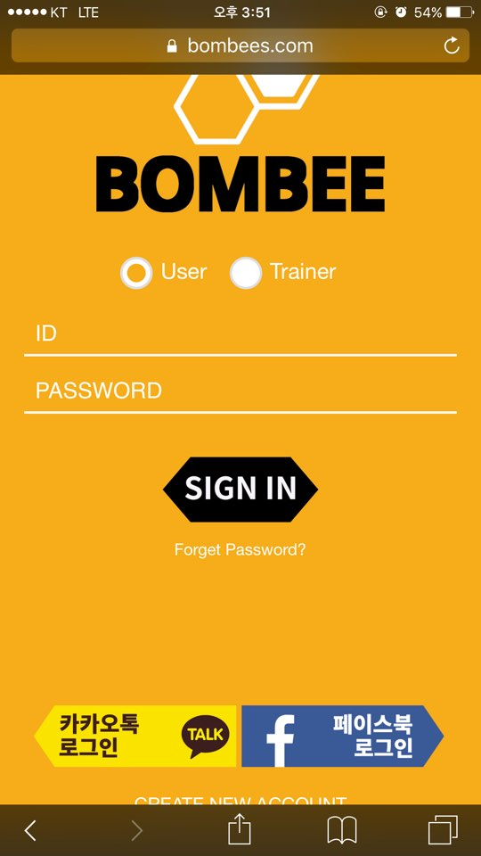

- Sign Up

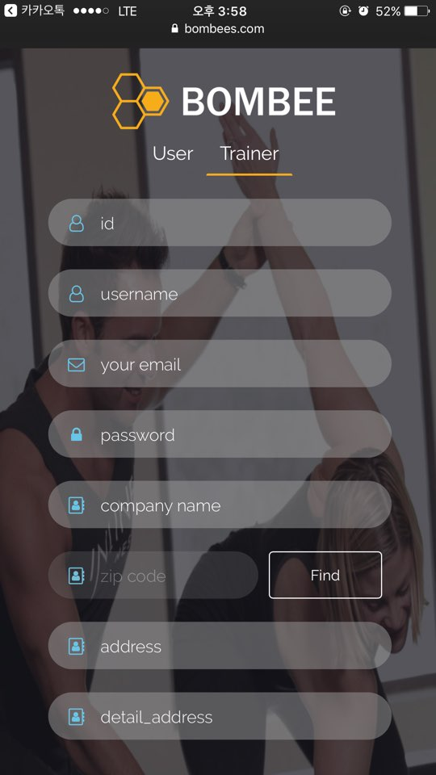 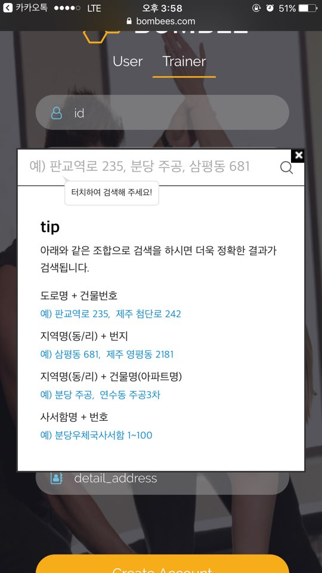

- Main

 

- Real-time Location Map


- Navigator Bar

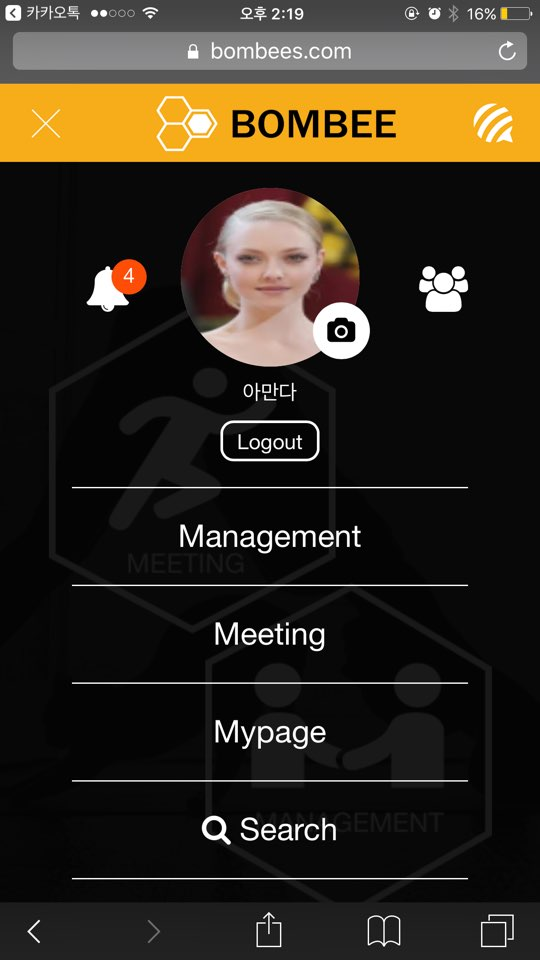

- Promotion List


- Trainer

  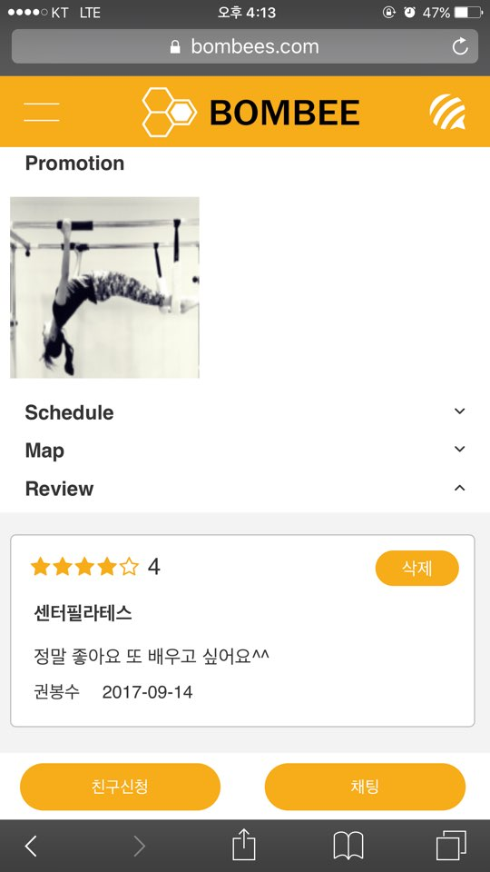

- Add Promotion

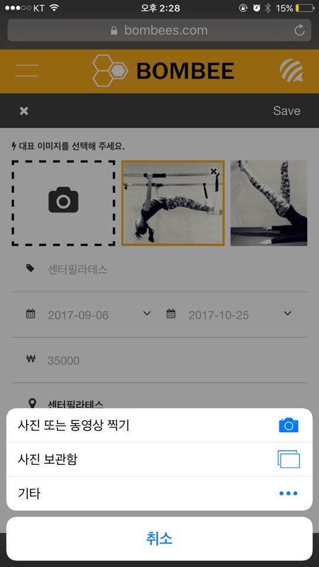

- Promotion Add List

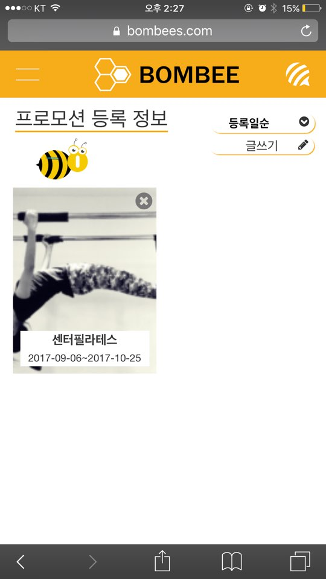

- Apply for Match

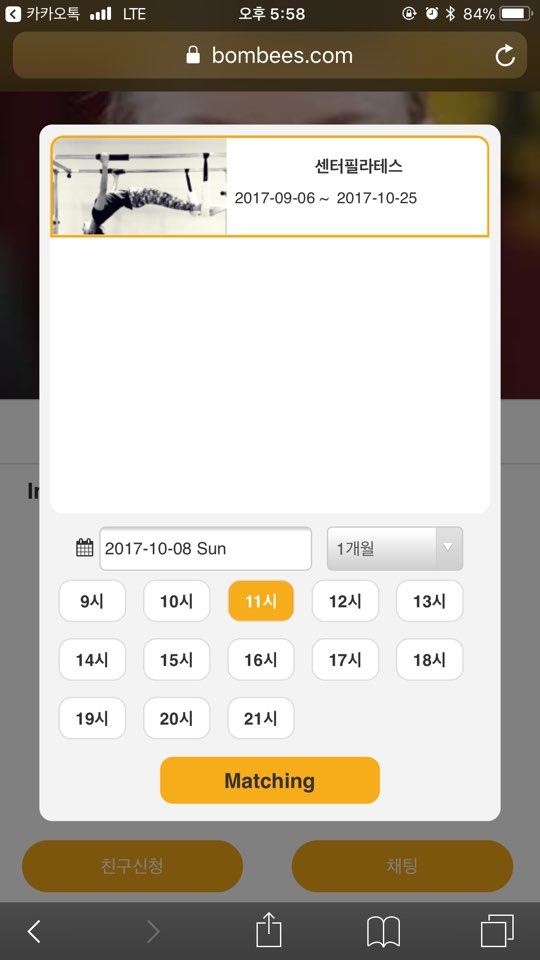

- Notification

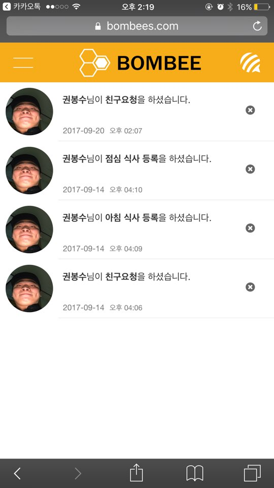 

- Matching Request List

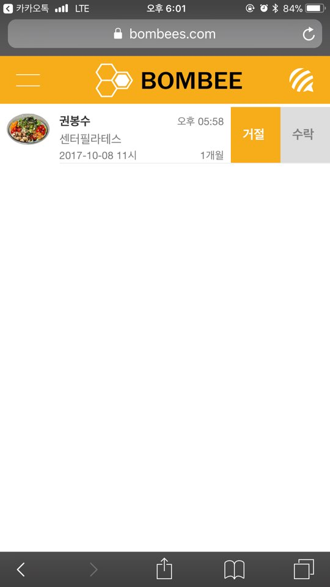 

- Promotion in Progress

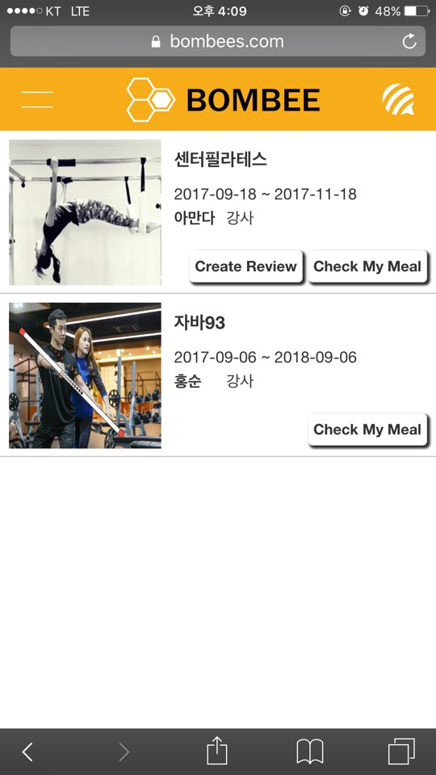

- Diet Management


- Review

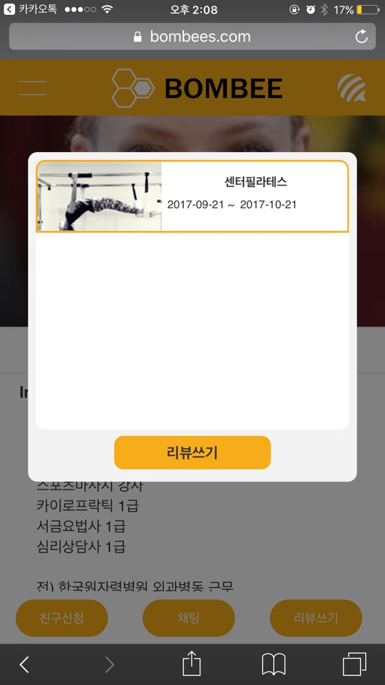 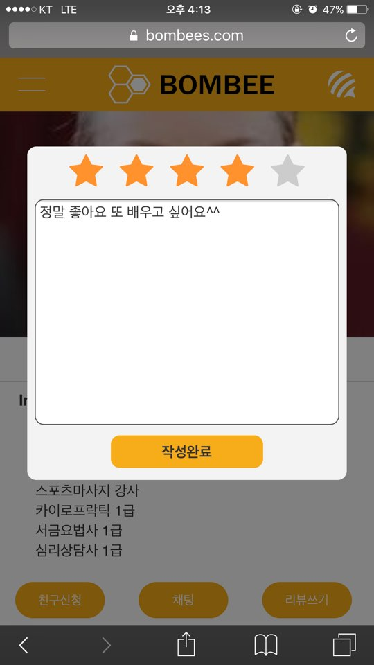

- Chating

 

# 테이블 구조

- DB table


| ACCOUNT MEMB 테이블(일반 사용자)|||
| :-----: | :-: |:-: |
| MNO **`(PK)`**	|회원번호	|INTEGER NOT NULL|
| ID	| 아이디		| VARCHAR(50)	NOT NULL|
| EMAIL	| 이메일		| VARCHAR(50)	NOT NULL|
| ACCOUNTTYPE	| 가입유형		|INTEGER	NOT NULL|
| IMG	| 사진경로	| VARCHAR(255) |
| MTYPE	| 사용자 타입	| INT(11)	NOT NULL|
| NAME	|이름		| VARCHAR(255)	NOT NULL|
| PASSWORD	|비번		| VARCHAR(255)	NOT NULL|

| ACCOUNT TCHER 테이블(트레이너)|||
| :-----: | :-: |:-: |
| TNO **`(PK)`**	|회원번호	|INTEGER NOT NULL|
| INTRODUCTION | 소개	| VARCHAR(255) |
| COMPANY	| 회사명	| VARCHAR(50)	NOT NULL|
| ZIPCODE	| 우편번호	| VARCHAR(255)	NOT NULL|
| COMADDR	| 회사주소	| VARCHAR(255) NOT NULL|
| COMDETAILADDR	| 상세주소	| VARCHAR(255)	NOT NULL|
| SPONO	| 운동번호	| INTEGER |


| PROMOTION 테이블(프로모션)|||
| :-----: | :-: |:-: |
| PNO **`(PK)`**	| 프로모션 번호	| INTEGER NOT NULL	|
| TNO **`(FK)`** | 강사 번호	| INTEGER	NOT NULL|
| TITL	| 타이틀	| VARCHAR(50)	NOT NULL|
| CONTENT | 프로모션 내용	| TEXT	NOT NULL|
| SDT	| 프로모션 시작일	|VARCHAR(255) NOT NULL|
| EDT	| 프로모션 종료일	|VARCHAR(255) NOT NULL|
| PRIC	| 가격	| INTEGER NOT NULL|
| LAT	| 위도	| DOUBLE |
| LNG	| 경도	| DOUBLE |
| EXPIRE	| 만료 여부	| INTEGER |

| PROMOTIONIMG 테이블(프로모션 이미지)|||
| :-----: | :-: |:-: |
| IMGNO **`(PK)`**	| 이미지 번호	| INTEGER NOT NULL	|
| PNO **`(FK)`** | 프로모션 번호	| INTEGER	NOT NULL|
| PIMG	| 이미지 경로	| VARCHAR(255)	NOT NULL|
| TITLEPIC	| 타이틀 사진 여부	| BOOLEAN |

| MEMB_MANAGE 테이블(진행 프로모션)|||
| :-----: | :-: |:-: |
| MEALNO **`(PK)`**	| 진행 프로모션 번호	| INTEGER NOT NULL	|
| TRANO	**`(FK)`**| 연결된 개인트레이너 번호	| INTEGER NOT NULL|
| MEALTYPE | 끼니	| VARCHAR(255)	NOT NULL|
| MEALPIC | 끼니 사진	경로 | VARCHAR(255)	NOT NULL	|
| MEALCAL	| 칼로리	| INTEGER NOT NULL |
| MEALNAME	| 식단 이름	| VARCHAR(255)	NOT NULL |
| DATE	| 일시	| DATE NOT NULL |
| DAY	| 요일 	| VARCHAR(255) NOT NULL |
| CONFIRM	| 확인 여부 	| BOOLEAN NOT NULL |


| TCHER_TRAINER 테이블(매칭시 개인트레이너)|||
| :-----: | :-: |:-: |
| TRANO **`(PK)`**	| 연결된 개인트레이너 번호	| INTEGER NOT NULL	|
| MNO	**`(FK)`**| 연결된 멤버 번호	| INTEGER NOT NULL|
| TNO	**`(FK)`**| 연결된 강사 번호	| INTEGER NOT NULL|
| PNO	**`(FK)`**| 연결된 프로모션 번호	| INTEGER NOT NULL|
| SDT	| 프로모션 시작일	|VARCHAR(255) NOT NULL|
| EDT	| 프로모션 종료일	|VARCHAR(255) NOT NULL|
| PERIOD	| 신청 개월 수		| INTEGER	|
| CONFIRM	| 확인 여부 	| BOOLEAN NOT NULL |
| REQDATE	| 요청 날짜	| DATE NOT NULL	|
| WISHTIME	| 원하는 시간	| INTEGER NOT NULL	|
| WRITEREV	| 리뷰 여부	| BOOLEAN	NOT NULL|
| TITLE		|제목			| VARCHAR(255) NOT NULL	|

| ALERT 테이블(알람)|||
| :-----: | :-: |:-: |
| ALNO **`(PK)`**	| 알람 번호	| INTEGER NOT NULL|
| OTHERNAME | 상대방 이름	| VARCHAR(255) NOT NULL|
| MYMNO | 요청한 사람 회원번호	| INTEGER	NOT NULL|
| KINDS | 알람 종류 | VARCHAR(255)	NOT NULL|
| DATE | 알람 발생 날짜 | VARCHAR(50)	NOT NULL|
| CONFIRM	| 확인 여부 	| BOOLEAN NOT NULL |
| TYPE | 알람 종류 분류	| INTEGER NOT NULL |
| OTHERMNO | 상대방 사용자 번호	| INTEGER NOT NULL |

| SCHEDULE 테이블(강사 스케줄)|||
| :-----: | :-: |:-: |
| SCHNO **`(PK)`**	| 스케쥴 번호	| INTEGER NOT NULL|
| TNO	**`(FK)`**| 강사 번호	| INTEGER NOT NULL|
| DAY | 요일	| VARCHAR(255)	NOT NULL|
| TIME | 시간 | VARCHAR(255)	NOT NULL|

| TCHER_REVIEW 테이블(리뷰)|||
| :-----: | :-: |:-: |
| REVIEWNO **`(PK)`**	| 리뷰 번호	| INTEGER NOT NULL|
| TRANO **`(FK)`**| 연결된 개인트레이너 번호	| INTEGER NOT NULL|
| SCORE | 평점	| INTEGER	NOT NULL|
| PNO | 연결된 프로모션 번호 | INTEGER	NOT NULL|
| PROTITL | 연결된 프로모션 타이틀 | VARCHAR(255)	NOT NULL|
| DATE | 리뷰 작성 날짜	| VARCHAR(255) NOT NULL|

| CHAT 테이블(채팅)|||
| :-----: | :-: |:-: |
| CNO **`(PK)`**| 채팅 번호	| INTEGER NOT NULL|
| MNO	**`(FK)`**| 멤버 번호	| INTEGER NOT NULL|
| TNO	**`(FK)`**| 강사 번호	| INTEGER NOT NULL|
| WHOSEND | 보낸 사람	| INTEGER	NOT NULL|
| MSG | 메세지	| TEXT	NOT NULL|
| CONFIRM | 확인 여부 | BOOLEAN NOT NULL|
