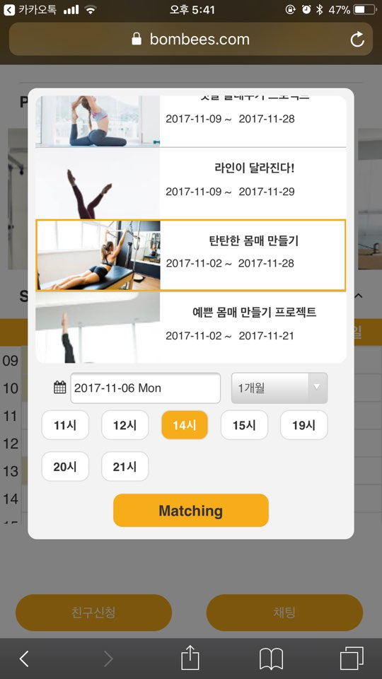

# 9. Apply for Match

## 페이지 소개
* 사용자가 강사를 선택하여 매칭을 요청 하는 페이지
  
## 구동원리
* 강사의 현재 진행 중인 프로모션을 선택 하고 강사의 스케쥴을 검색하여 가능한 시간을 보여주고 사용자가 원하는 시간을 선택하여 매칭
## 화면
- Apply for Match

  
## 사용기술
* JavaScript libraies : jQuery 

## [BOMBEE (돌아가기)](../../README.md) 
