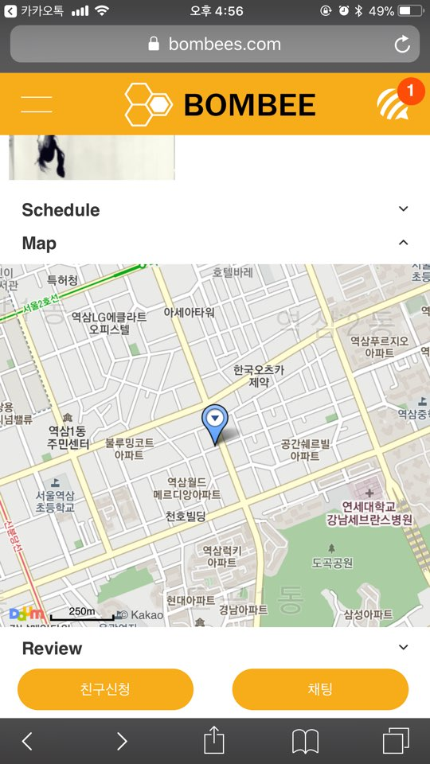

# 6. Trainer

## 페이지 소개
* 트레이너 상세 페이지입니다.
  
## 구동원리
* 친구신청 기능을 통해 고객과 매칭할 수 있음
* 채팅 기능을 통해 고객의 문의사항 및 스케줄 조정 등을 할 수 있음(채팅서버 : NodeJS)
* Daum Map Api를 통해 트레이너가 근무하는 트레이닝 센터 위치를 보여줌
  
## 화면

- Trainer

    
  
## 사용기술
* JavaScript libraies : jQuery, Handlebars, SweetAlert2, Swiper
* Api : Daum Map Api 

## [BOMBEE (돌아가기)](../../README.md) 
